## Where we are

- Last week: what *is* a model, and why do psychologists build them?
- Today: once you have a model, how do you find the numbers that make it fit your data?

------------------------------------------------------------------------

## Learning objectives

By the end of today you should be able to:

1.  Explain what a parameter is, and why we need to *estimate* it from data

2.  Explain, in words, what the scale and shape parameters of a Weibull psychometric function represent

3.  Explain what RMSD is, and why data never sits exactly on a fitted curve

4.  Use grid search to find best-fitting parameters by hand, and explain why it doesn't scale

5.  Explain, at a high level, how `optim()`'s default method (Nelder-Mead simplex) searches — and its limitations, including local minima

6.  Explain the idea of maximum likelihood, and how it relates to simulating data

7.  Fit a model using both RMSD and maximum likelihood

------------------------------------------------------------------------

## What is Artificial Intelligence (AI)?

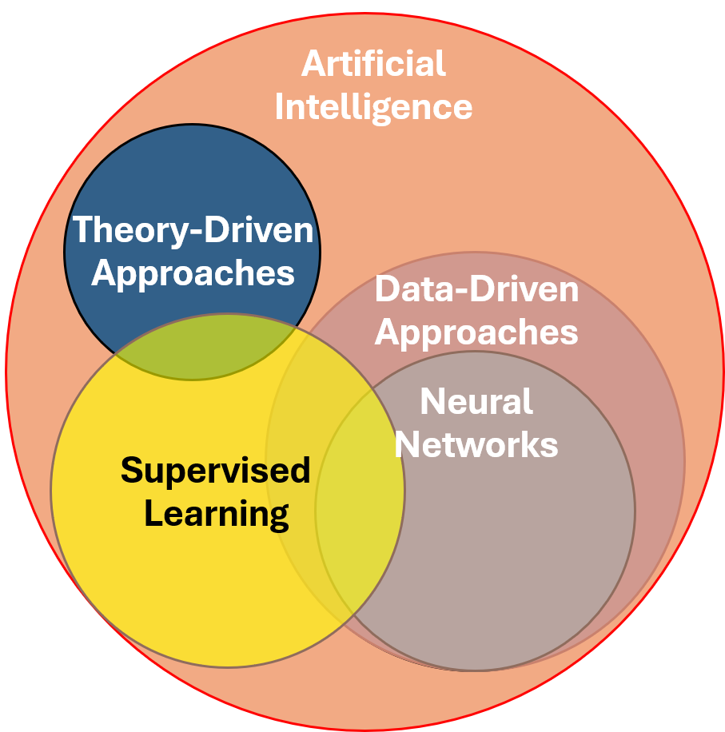{width="488"}

------------------------------------------------------------------------

## Supervised Learning

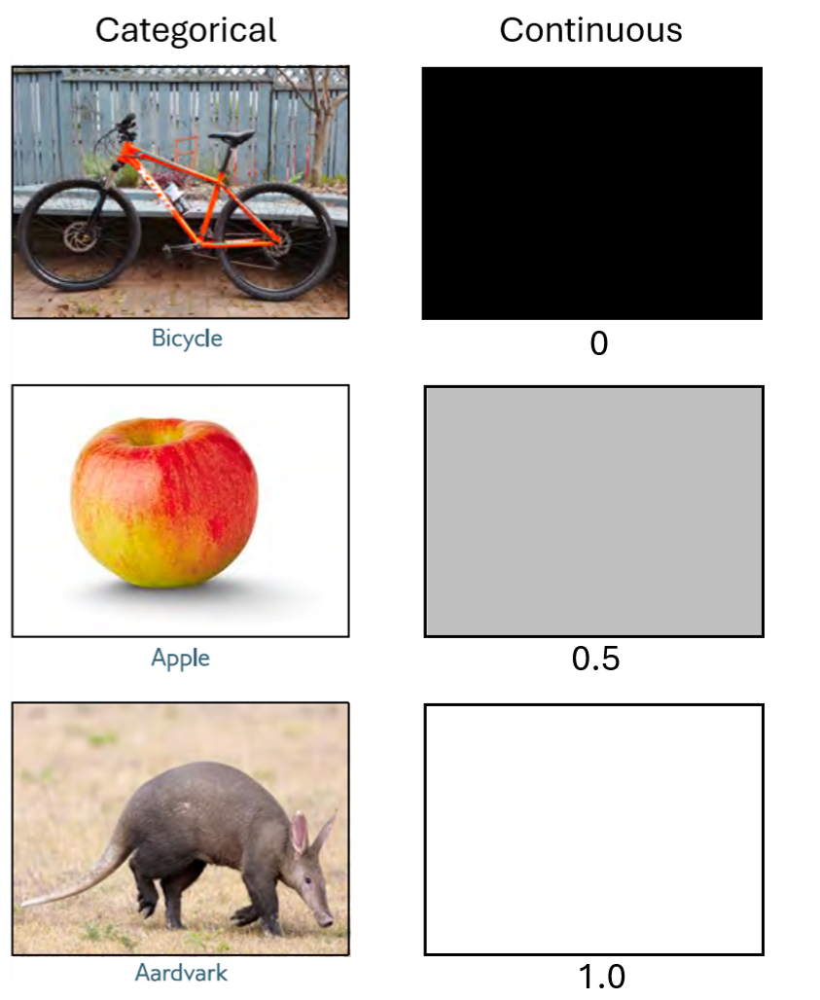{width="465"}

------------------------------------------------------------------------

## Regression

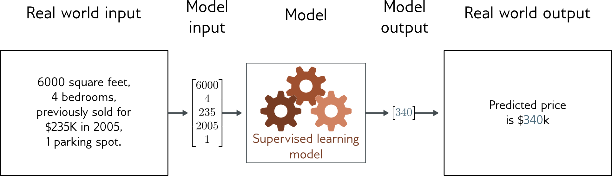

- Univariate regression problem (one output, real value)
- Prince, S. J. (2023). Understanding deep learning. MIT press.

------------------------------------------------------------------------

## Supervised learning overview

- **Supervised learning model** = mapping from one or more inputs to one or more outputs

- Model is a mathematical equation (or family of equations)

- Model also includes **parameters**

- Parameters affect outcome of equation

- **Training** a model = finding parameters that predict outputs “well” from inputs for a **training dataset** of input/output pairs

- See [live demos 2.1, 2.2, 2.4](https://udlbook.github.io/udlfigures/) from Chapter 2 in Prince, S. J. (2023). Understanding deep learning. MIT press.

  - https://udlbook.github.io/udlfigures/

------------------------------------------------------------------------

## Example: 1D Linear regression model ([demo 2.1](https://udlbook.github.io/udlfigures/))

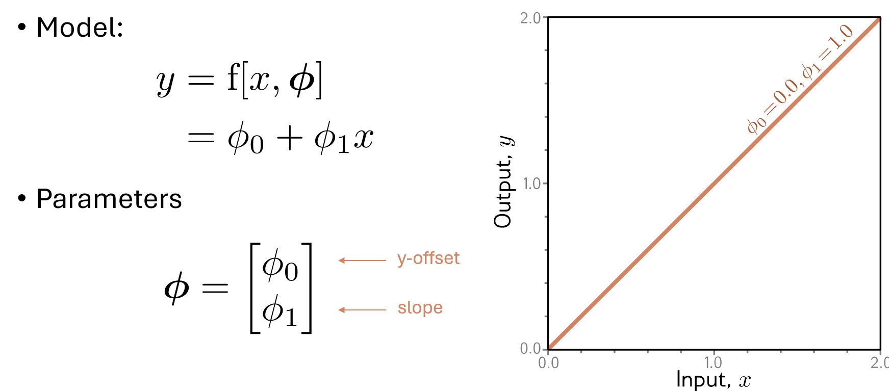

------------------------------------------------------------------------

## Example: 1D Linear regression model ([demo 2.1](https://udlbook.github.io/udlfigures/))

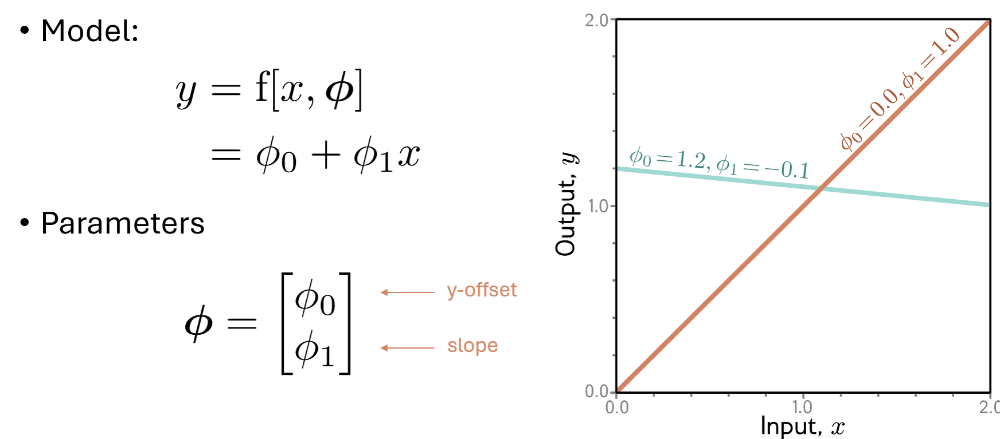

------------------------------------------------------------------------

## Example: 1D Linear regression model ([demo 2.1](https://udlbook.github.io/udlfigures/))

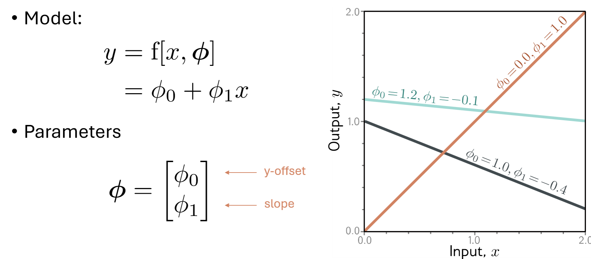

------------------------------------------------------------------------

## Example: 1D Linear regression model ([demo 2.2](https://udlbook.github.io/udlfigures/))

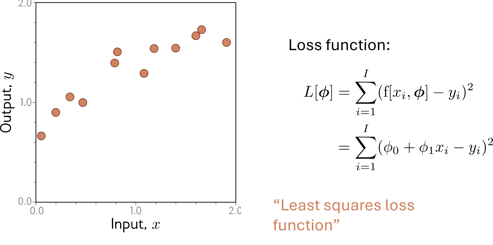

------------------------------------------------------------------------

## Example: 1D Linear regression model ([demo 2.2](https://udlbook.github.io/udlfigures/))

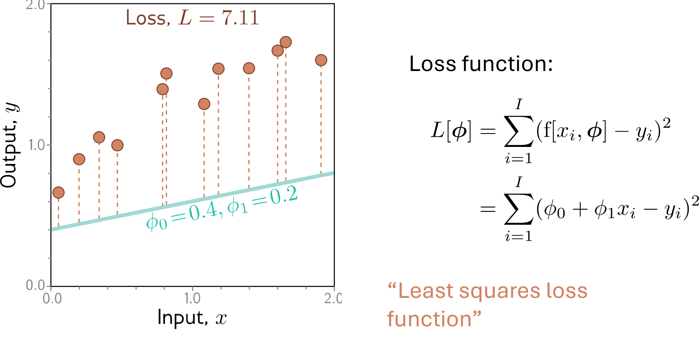

------------------------------------------------------------------------

## Example: 1D Linear regression model ([demo 2.2](https://udlbook.github.io/udlfigures/))

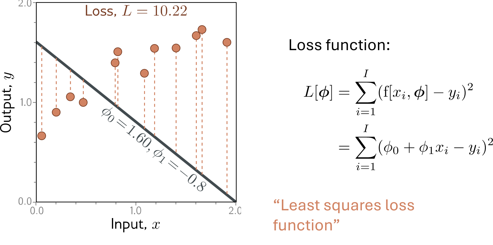

------------------------------------------------------------------------

## Example: 1D Linear regression model ([demo 2.2](https://udlbook.github.io/udlfigures/))

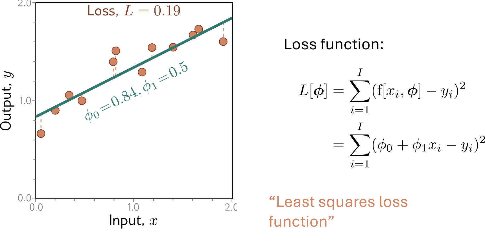

------------------------------------------------------------------------

## Example: 1D Linear regression model ([demo 2.4](https://udlbook.github.io/udlfigures/))

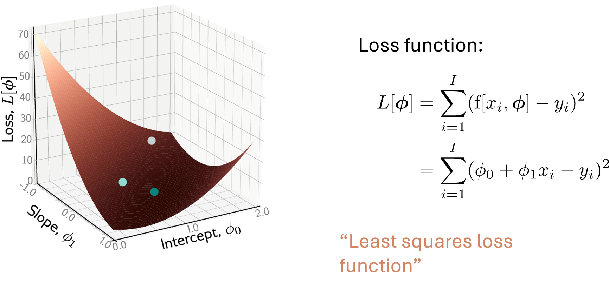

------------------------------------------------------------------------

## Example: 1D Linear regression model

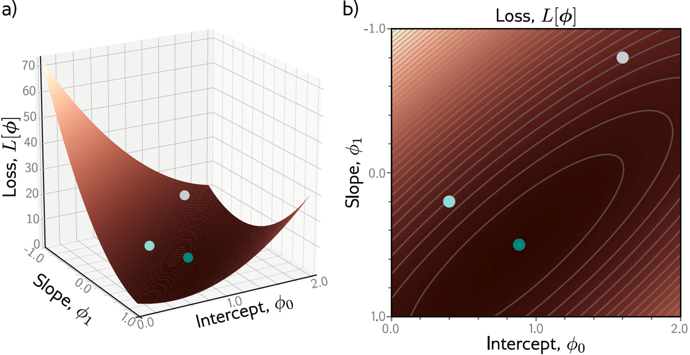

------------------------------------------------------------------------

## Example: 1D Linear regression model

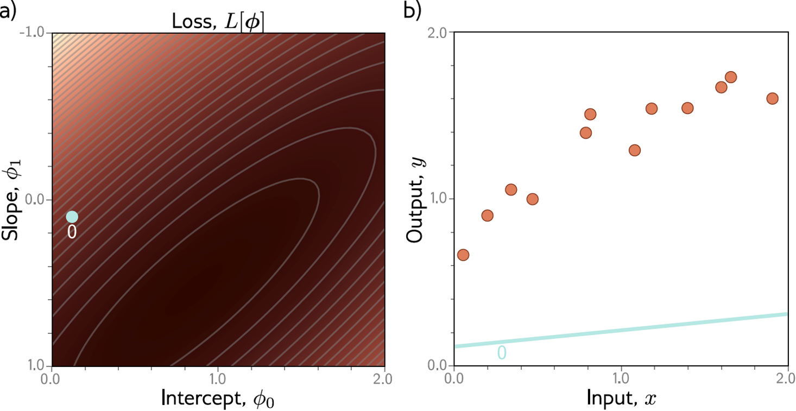

------------------------------------------------------------------------

## Example: 1D Linear regression model


------------------------------------------------------------------------

## Example: 1D Linear regression model

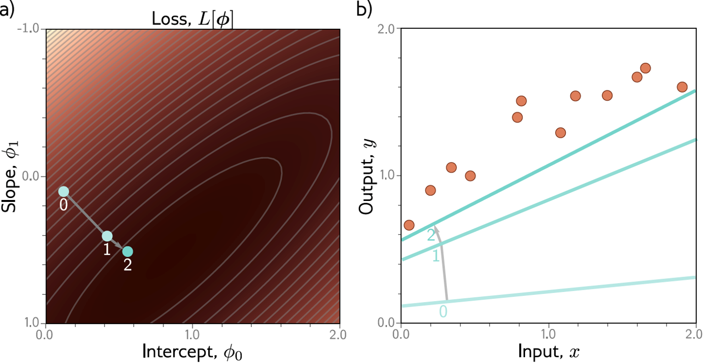

------------------------------------------------------------------------

## Example: 1D Linear regression model


------------------------------------------------------------------------

## Example: 1D Linear regression model

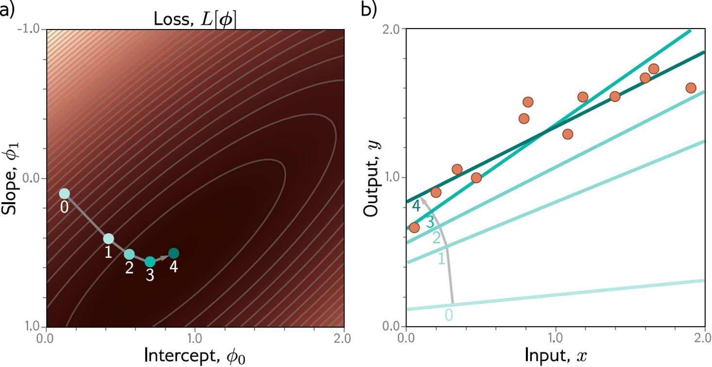

------------------------------------------------------------------------

## Possible objections:

- But you can fit the line model in closed form!
  - Yes – but we won’t be able to do this for more complex models
- But we could exhaustively try every slope and intercept combo!
  - Yes – but we won’t be able to do this when there are a million parameters

------------------------------------------------------------------------

## Supervised learning overview {.smaller .scrollable}

- **Supervised learning model** = mapping from one or more inputs to one or more outputs

- Model is a mathematical equation (or family of equations)

- Model also includes **parameters**

- Parameters affect outcome of equation

- **Training** a model = finding parameters that predict outputs “well” from inputs for a **training dataset** of input/output pairs

- See [live demos 2.1, 2.2, 2.4](https://udlbook.github.io/udlfigures/) from Prince, S. J. (2023). Understanding deep learning. MIT press. -https://udlbook.github.io/udlfigures/

- **Next: An example with data fit to non-linear model**

------------------------------------------------------------------------

## Psychometric functions

- The **psychometric function** is a summary of the relation between performance in a classification task (such as the ability to detect or discriminate between stimuli) and stimulus level/intensity (*Knoblauch & Maloney, 2012, Chapter 4*)

::: fragment
- 3 steps of modelling data:
  - **Collect psychophysical data**\
  - **Estimate model parameters from data**
  - Model evaluation and criticism (goodness-of-fit, systematic prediction errors, confidence regions, bias, ...)
:::

------------------------------------------------------------------------

## What are psychophysical data?

Psychophysical data are obtained from a psychophysical experiment. Commonly a researcher wants to associate external stimulus variables with internal representations, and measures performance related to manipulations of these external variables.

------------------------------------------------------------------------

## What are psychophysical data?

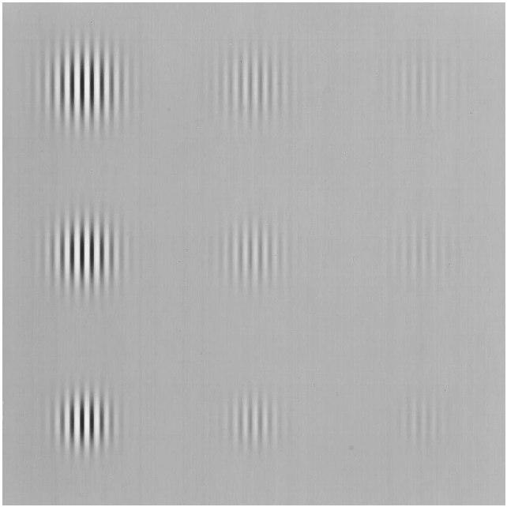

Decreasing contrast values (harder to detect)——\>

------------------------------------------------------------------------

## What are psychophysical data?

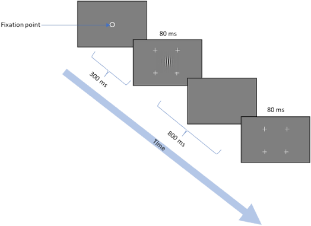

- This is what one trial sequence looks like from the participant's side

- Which interval had the stimulus? Interval 1 or 2?

- Repeat this many times per contrast intensity, and the proportion of "correct" answers is what traces out the curve

- image from : Serero, G., Lev, M., Sagi, D., & Polat, U. (2023). Traces of early developmental bias in the adult brain. Scientific Reports, 13(1), 12014.

------------------------------------------------------------------------

## Psychophysical data

Classic psychophysics setup: on each trial, the participant says whether the stimulus was in interval 1 or 2. We repeat this many times at each of several contrast levels.

```{r}
contrast <- seq(0,1,0.12)
n_trials <- rep(40, 9)
n_correct <- c(16, 25, 23, 24, 25, 36, 37, 38, 40)
prop_correct <- n_correct / n_trials

data <- data.frame(contrast, n_correct, n_trials, prop_correct)
data
```

::: notes
This is presented as if it were a real dataset — no generating code, no "true" parameters revealed. The tutorial will later show you how a dataset like this could be simulated with known parameters, once you're comfortable with the fitting tools themselves.
:::

------------------------------------------------------------------------

## Plotting the data

```{r}
#| fig-hold: true

# Set plot region to a physical square ("s")
old_par <- par(pty = "s")

plot(data$contrast, data$prop_correct, 
     pch = 19, 
     xlim = c(0, 1),
     ylim = c(0.4, 1), 
     xlab = "Stimulus contrast",
     ylab = "Proportion correct responses",
     main = "Psychometric function")

# Restore original default layout parameters ("m" for maximal/rectangular)
par(old_par)
```

- The curve rises from near 0.5 to near 1 as intensity increases — an S-shape
- To describe this curve with a model, we need just two numbers

::: notes
Point at the plot: roughly where does it start rising steeply, and roughly how gradual or sharp is the rise. Don't name the parameters yet — that's the next slide.
:::

------------------------------------------------------------------------

## The model {.smaller}

$$p(x) = 1 - e^{-(x/\alpha)^{\beta}}, \quad x \geq 0$$

This is the **Weibull cumulative distribution function** — see [Wikipedia: Weibull distribution](https://en.wikipedia.org/wiki/Weibull_distribution) for the full mathematical background.

- `alpha` (threshold)

- `beta` (slope)


------------------------------------------------------------------------

## The model {.smaller}

- the Weibull CDF falls between 0 and 1. But our data falls between 0.5 and 1. We can thus squish our psychometric model to fall in the region of 0.5 to 1 as follows: $$p(x) = a + b*(1 - e^{-(x/\alpha)^{\beta}}), \quad x \geq 0$$

- `a` and `b` are also parameters

- Here, `b` compresses the function to all between 0 and `b`, and `a` adds a constant such that the output of the function ranges from \[`a`, `a`***+*** `b`\]

- Given our data falls between 0.5 and 1, we assign`a`, and `b` to be 0.5

```{r}
psychometric_model <- function(alpha, beta, x) {
  y <- rep(0, length(x))
  valid <- x >= 0
  y[valid] <- 0.5 + 0.5*(1 - exp(-(x[valid] / alpha)^beta))
  y
}
```

Let's see whether a plausible guess looks like our data:

```{r}
old_par <- par(pty = "s")
plot(data$contrast, data$prop_correct, pch = 19, ylim = c(0, 1),
     xlab = "Intensity", ylab = "P('yes')")
curve(psychometric_model(.5, 1, x), add = TRUE, col = "blue")
# Restore original default layout parameters ("m" for maximal/rectangular)
par(old_par)
```

::: notes
Unlike the cumulative normal, the Weibull CDF has no dependency on a built-in distribution function at all — it's written directly from its own formula, using only exp() and arithmetic. This is worth pointing out explicitly: nothing here is a black box. The overlay is a nice payoff: alpha=5, beta=3 wasn't fit to this data at all, it's just a reasonable guess, and it already tracks the general shape reasonably well, even with the noise in a couple of the data points.
:::

------------------------------------------------------------------------

## What does `alpha` do? {.smaller}

```{r}
#| fig-hold: true

old_par <- par(pty = "s")

curve(psychometric_model(.2, 1, x),
      from = 0, to = 1, n = 1000,
      xlim = c(0, 1), ylim = c(.5, 1),
      col = "red",
      xlab = "Contrast",
      ylab = "P('yes')",
      main = "Varying alpha (beta fixed at 1)")

curve(psychometric_model(.5, 1, x),
      from = 0, to = 1, n = 1000,
      add = TRUE, col = "blue")

curve(psychometric_model(.8, 1, x),
      from = 0, to = 1, n = 1000,
      add = TRUE, col = "darkgreen")

# Horizontal line at the alpha/63% point
abline(h = 0.5 + 0.5 * (1 - exp(-1)),
       lty = 2, col = "gray40")

# Vertical lines at each alpha
abline(v = c(.2, .5, .8),
       lty = 2, col = "gray40")

legend("bottomright",
       legend = c("alpha = .2", "alpha = .5", "alpha = .8"),
       col = c("red", "blue", "darkgreen"),
       lty = 1)

par(old_par)
```

- `alpha` is a **scale** parameter, not a pure shift: increasing it moves the curve right *and* stretches its width — notice the three curves above aren't just shifted copies of each other, the alpha=.8 curve is visibly more gradual than the alpha=.3 curve
- A useful fixed point regardless of `beta`: the curve always reaches about **82%** at `x = alpha` (a property of the Weibull's mathematical form)
- Psychologically: how sensitive the person is overall — a lower `alpha` means they reach a given detection level at a fainter stimulus
- `alpha` : threshold / location parameter

::: notes
Let students watch alpha and only alpha change; unlike a pure location parameter, the curves here should visibly differ in width too, not just position — worth pausing on this since it's a genuine (and useful) contrast with the cumulative normal's mu, which really was a pure shift. The 63% fact is worth stating explicitly (it comes from 1 - e\^-1 ≈ 0.632) — it's the Weibull's fixed reference point, playing a similar role to "mu is the 50% point" for the cumulative normal, just without the "no width change" guarantee.
:::

------------------------------------------------------------------------

## What does `beta` do? {.smaller}

```{r}
#| fig-hold: true

old_par <- par(pty = "s")

curve(psychometric_model(.5, .5, x),
      from = 0, to = 1, n = 1000,
      xlim = c(0, 1), ylim = c(.5, 1),
      col = "red",
      xlab = "Contrast", ylab = "P('yes')",
      main = "Varying beta (alpha fixed at .5)")

curve(psychometric_model(.5, 1, x),
      from = 0, to = 1, n = 1000,
      add = TRUE, col = "blue")

curve(psychometric_model(.5, 2, x),
      from = 0, to = 1, n = 1000,
      add = TRUE, col = "darkgreen")

curve(psychometric_model(.5, 4, x),
      from = 0, to = 1, n = 1000,
      add = TRUE, col = "purple")

# Horizontal line at the alpha/63% point
abline(h = 0.5 + 0.5 * (1 - exp(-1)),
       lty = 2, col = "gray40")

# Vertical lines at each alpha
abline(v = c( .5),
       lty = 2, col = "gray40")

legend("bottomright",
       legend = c("beta = .5", "beta = 1",
                  "beta = 2", "beta = 4"),
       col = c("red", "blue", "darkgreen", "purple"),
       lty = 1)

par(old_par)
```

- `beta` controls **how sharply** the curve rises — all three curves pass through the same 82% point (at `x = .5`, i.e., when `x = alpha`) but climb at very different rates
- Psychologically: how *reliably* the person's responses track the physical stimulus
- `beta` : slope / steepness parameter

------------------------------------------------------------------------

## Why don't the dots sit exactly on the curve?

- The model gives a single, *deterministic* prediction for each intensity
- But real data always has some trial-to-trial noise
- We can think of the data as: **model prediction + random error**

$$\text{observed} = \text{model}(\alpha, \beta, x) + \text{error}$$

- This is *why* fitting can get close but never perfect

------------------------------------------------------------------------

## How wrong is a guess? — RMSD {.smaller}

Following the textbook, we use the **root mean squared deviation (RMSD)** rather than a raw sum of squares:

$$\text{RMSD} = \sqrt{\frac{\sum_{j=1}^{J}(d_j - p_j)^2}{J}}$$

```{r}
rmsd <- function(params, data) {
  alpha <- params[1]
  beta <- params[2]
  predicted <- psychometric_model(alpha, beta, data$contrast)
  sqrt(mean((data$prop_correct - predicted)^2))
}

rmsd(c(.1, 2), data)    # a bad-ish guess
rmsd(c(.5, 1), data)   # a better guess

```

- Bigger number = worse fit; our job is to make it as small as possible
- RMSD is in the same units as the data (here, a proportion) and doesn't grow just because we collected more data points, unlike a raw sum of squares — this is why the textbook (and most of the field) prefers it

::: notes
Run both lines live. The "same units as the data" point is worth emphasizing explicitly — students will meet RMSD values as pure numbers all course, and knowing they're interpretable (e.g., "off by 3 percentage points on average") makes them far less abstract.
:::

------------------------------------------------------------------------

## Seeing RMSD: a few deliberately bad fits

```{r}
#| fig-width: 10
#| fig-height: 8

candidates <- list(
  c(alpha = 0.1, beta = 3),
  c(alpha = 0.6, beta = 3),
  c(alpha = 0.6, beta = 100),
  c(alpha = 0.1, beta = 100)
)

par(mfrow = c(2, 2))

for (cand in candidates) {
  
  x_pred <- seq(0, 1, length.out = 200)
  pred_curve <- psychometric_model(
    cand["alpha"],
    cand["beta"],
    x_pred
  )
  
  r <- round(rmsd(cand, data), 3)
  
  plot(data$contrast, data$prop_correct,
       pch = 19,
       xlim = c(0, 1),
       ylim = c(0, 1),
       xlab = "Contrast",
       ylab = "P(correct)",
       main = paste0(
         "alpha = ", cand["alpha"],
         ", beta = ", cand["beta"],
         "  (RMSD = ", r, ")"
       ))
  
  lines(x_pred, pred_curve, col = "blue", lwd = 2)
}
```

::: notes
Deliberately pick one good fit and three clearly bad ones (wrong scale, wrong shape, both wrong) so students can connect "this curve visually misses the dots" to "and that's why its RMSD number is high." Point out explicitly which panel has the lowest RMSD and confirm it's also the one that looks best by eye.
:::

------------------------------------------------------------------------

## Grid search: try everything

```{r}
alpha_vals <- seq(0.01, 1, length.out = 100)
beta_vals <- seq(0.1, 6, length.out = 100)
grid <- expand.grid(alpha = alpha_vals, beta = beta_vals)

grid$rmsd <- apply(grid, 1, function(row) rmsd(row, data))

dim(grid)
head(grid, 10)
```

```{r}
best <- grid[which.min(grid$rmsd), ]
best
```

- `dim(grid)` confirms we're testing 100 x 100 = 10,000 combinations — every row in `head(grid, 10)` above is one candidate `(alpha, beta)` pair, with its RMSD already computed

------------------------------------------------------------------------

## Seeing the cost surface {.smaller}

```{r}
library(lattice)
cost_palette <- colorRampPalette(c("white", "steelblue", "midnightblue"))(100)
levelplot(rmsd ~ alpha * beta, data = grid,
          main = "RMSD across parameter combinations",
          xlab = "alpha (scale)", ylab = "beta (shape)",
          col.regions = cost_palette)
```

- Dark blue = low RMSD = good fit
- Our best-fitting combination sits at the bottom of that "valley"

------------------------------------------------------------------------

## Grid search doesn't scale {.smaller}

| \# parameters | grid points per parameter | total combinations to test |
|:----------------------:|:----------------------:|:----------------------:|
| 2 (today's model) | 100 | 10,000 |
| 4 | 100 | 100,000,000 |
| 10 (a small neural network) | 100 | 10\^20 |

- Two parameters: totally fine on a laptop
- A handful more: computationally impossible to brute-force
- We need something smarter that *searches intelligently* instead of trying everything

::: notes
Read the last row out loud slowly so the scaling problem registers as absurd rather than abstract.
:::

------------------------------------------------------------------------

## What is `optim()` actually doing? {.smaller}

Two physical metaphors the textbook uses:

- Imagine the error surface carved out of wood, and you drop a marble onto it — it rolls downhill and comes to rest at the bottom

- Or: a parachutist dropped onto unfamiliar terrain at night, who can't see the whole landscape, only feels which way is downhill from where she's standing right now, and takes small steps accordingly

- Start somewhere (your initial guess), move downhill, repeat until no nearby step improves things

- Much faster than grid search — it doesn't need to check every point on the map

- But: it can walk straight into a small valley that isn't the lowest one overall — a **local minimum**

------------------------------------------------------------------------

## Meet the method: Nelder-Mead Simplex {.smaller}

- When you call `optim()`, its default method is the **Nelder-Mead Simplex** algorithm (Nelder & Mead, 1965).
- A "simplex" is a simple geometric shape: for 2 parameters, it's a **triangle**, with each corner being one candidate `(alpha, beta)` combination to test. For example, one corner might be `(.1, 2)`, another `(.4, 5)`, another `(.6, 6)`
- At each step, the corner with the *worst* fit is moved: either **reflected** to the opposite side of the triangle (and possibly stretched further, if that direction looks promising), or the whole triangle **contracts** inward if reflection doesn't help
- Repeating this, the triangle "tumbles" downhill and eventually shrinks to a single point, the best-fitting estimate

------------------------------------------------------------------------

## Watching a simplex tumble downhill

```{r}
#| echo: false
triangle <- rbind(c(.1, 6), c(.1, 03), c(.2, 5))
triangle_history <- list(triangle)
max_iter <- 60
tol <- 1e-4

for (iter in 1:max_iter) {
  costs <- apply(triangle, 1, function(p) rmsd(p, data))
  if (diff(range(costs)) < tol) break

  worst <- which.max(costs)
  best  <- which.min(costs)
  centroid <- colMeans(triangle[-worst, , drop = FALSE])

  reflected <- centroid + (centroid - triangle[worst, ])
  reflected_cost <- rmsd(reflected, data)

  if (reflected_cost < costs[worst]) {
    triangle[worst, ] <- reflected                        # reflection improved things -- accept it
  } else {
    contracted <- centroid + 0.5 * (triangle[worst, ] - centroid)
    contracted_cost <- rmsd(contracted, data)
    if (contracted_cost < costs[worst]) {
      triangle[worst, ] <- contracted                      # contraction improved things -- accept it
    } else {
      best_point <- triangle[best, ]                       # neither helped -- shrink the whole triangle
      for (i in 1:3) {
        triangle[i, ] <- best_point + 0.5 * (triangle[i, ] - best_point)
      }
    }
  }
  triangle_history[[length(triangle_history) + 1]] <- triangle
}

n_steps <- length(triangle_history)

rmsd_matrix <- matrix(grid$rmsd, nrow = length(alpha_vals), ncol = length(beta_vals))
cost_palette <- colorRampPalette(c("white", "steelblue", "midnightblue"))(100)
image(alpha_vals, beta_vals, rmsd_matrix, col = cost_palette,
      xlab = "alpha (scale)", ylab = "beta (shape)",
      main = "A simplex tumbling downhill on the real RMSD landscape")
contour(alpha_vals, beta_vals, rmsd_matrix, add = TRUE, nlevels = 8)

step_colors <- colorRampPalette(c("black", "red"))(n_steps)
for (step in 1:n_steps) {
  tri <- triangle_history[[step]]
  polygon(tri[, 1], tri[, 2], border = step_colors[step], lwd = 2)
}
legend("bottomright", legend = c("Step 1 (black)", paste0("Step ", n_steps, " (red, converged)")),
       col = c("black", "red"), lty = 1, lwd = 2, bg = "white")
```

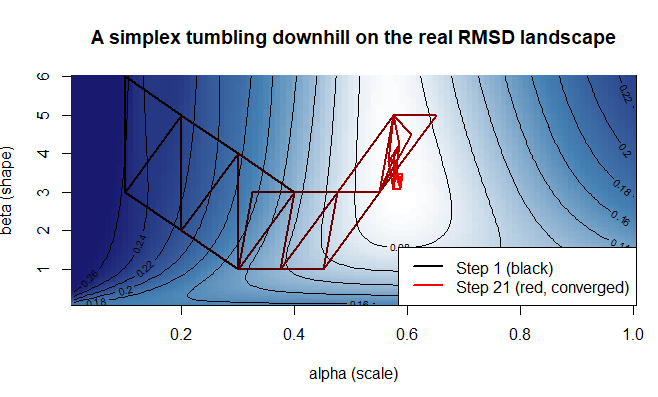

::: notes
This is the same RMSD landscape and color scale as the "Seeing the cost surface" slide, drawn with image() + contour() instead of a lattice levelplot so we can overlay the triangle on top of it. The simplex here is a genuinely simulated sequence, evaluated using our actual rmsd() function on the real data, and now runs until it actually converges (the triangle's three corners agree to within a small tolerance) rather than stopping after a fixed number of steps — so the exact number of steps shown will vary depending on the data and starting triangle. Each step tries, in order: reflect the worst corner through the centroid of the other two; if that doesn't help, contract it halfway toward the centroid instead; if even that doesn't help, shrink the whole triangle toward its best corner. Most steps only move one corner (reflection or contraction), but a shrink step moves all three at once — worth mentioning if a sharp-eyed student asks why two corners don't match between every single pair of neighboring steps. This is still a simplified version of the full algorithm (no expansion step for a very promising reflection), but it should now reliably converge all the way into the same dark valley from the "Seeing the cost surface" slide, color-coded from black (step 1) to red (the final, converged step). The code itself isn't the point here — focus on the figure.
:::

------------------------------------------------------------------------

## `optim()`: automatic search {.smaller}

```{r}
fit_rmsd <- optim(
  par = c(alpha = 4, beta = 1),
  fn = rmsd,
  data = data
)
fit_rmsd$par
fit_rmsd$value
```

- `par`: our starting guess
- `fn`: the function to minimize
- `method`: which search algorithm to use — defaults to `"Nelder-Mead"`, but can be set explicitly to something else, e.g. `"BFGS"` (Broyden–Fletcher–Goldfarb–Shanno):

``` r
optim(par = c(alpha = 4, beta = 1), fn = rmsd, data = data, method = "BFGS")
```

::: notes
Run the first version live and compare to `best` from the grid search — they should be very close. The method="BFGS" line is just shown, not run — the point is purely that method is a normal named argument you can override, not a deep dive into what BFGS does differently.
:::

------------------------------------------------------------------------

## Limitations: getting stuck in a local minimum {.smaller}

Not every landscape looks like our psychometric-function example. Here's a synthetic (illustrative, not psychologically meaningful) example with a bumpier landscape:

```{r}
toy_cost <- function(x, y) (x - 3)^2 + (y + 1)^2 + 15 * sin(x) * cos(y)

x_vals <- seq(-6, 10, length.out = 100)
y_vals <- seq(-6, 6, length.out = 100)
toy_grid <- expand.grid(x = x_vals, y = y_vals)
toy_grid$cost <- with(toy_grid, toy_cost(x, y))

levelplot(cost ~ x * y, data = toy_grid, main = "A landscape with multiple valleys")
```

- Several dark patches = several **local minima**; the single darkest patch overall is the **global minimum** — what we actually want
- There's no guarantee that what `optim()` finds is the global minimum rather than a local one — this is true of essentially all parameter estimation methods, not just Simplex
- One practical mitigation: run `optim()` several times from different starting values; if they all agree, that's good evidence you've found the global minimum

::: notes
Keep the toy landscape framed explicitly as synthetic (made-up x,y, not our alpha,beta) so students don't think our psychometric model secretly has hidden local minima it doesn't have.
:::

------------------------------------------------------------------------

## Limitations: struggling with many parameters

- Simplex becomes inefficient and unreliable with roughly 4 or more parameters
- We'll meet methods much better suited to many-parameter models in the next class

::: notes
A direct, honest hand-off to the neural network sessions, where gradient-based training methods that scale to far more parameters take over.
:::

------------------------------------------------------------------------

## A different kind of question

So far: "which parameters make my prediction closest to the data?"

A related but different question:

**"Which parameters make the data I actually observed most *probable*?"**

This is maximum likelihood estimation (MLE).

::: notes
Among all the possible parameter values, which ones would make the particular data pattern that I observed most likely to occur?

MLE asks: Which parameter values make the data I actually observed most likely under my model?

We're not asking which parameters produce the data we expected (like when minimizing RMSE). We're asking which parameters make the data we actually got most probable.
:::

------------------------------------------------------------------------

## From simulating to evaluating

Both `rbinom()` and `dbinom()` are functions that take the *same* per-trial probability as an input — and that probability itself comes from your model parameters, not the other way around:

`alpha`, `beta` → *prob* = *psychometric_model*(`alpha`, `beta`, `contrast`) → `rbinom()` or `dbinom()`

`rbinom()` generates simulated data from a known probability — you'll see this used in the tutorial to build a dataset with known "true" parameter values:

```{r}

alpha <- 0.5; beta <- 1; contrast_level <- 0.12; p <- psychometric_model(alpha, beta, contrast_level) # parameters -\> probability p

rbinom(1, size = 40, prob = p) # probability -\> simulated data

```

`dbinom()` does the reverse — it evaluates how probable a specific *outcome* was, given that same probability:

```{r}

dbinom(25, size = 40, prob = p)   # data + probability -> likelihood 

```

- `rbinom`: (`alpha`, `beta`) → *prob* → **data**
- `dbinom`: (`alpha`, `beta`) → *prob* , + *real data* → **probability of that data** (what MLE needs)
- Each trial in our psychometric experiment is exactly this kind of binomial event — `prob` is never a number you pick directly, it's always what the model predicts at that trial's contrast level

------------------------------------------------------------------------

## A simple case: detecting a fixed stimulus {.smaller}

Imagine presenting the same stimulus at a given contrast 10 times in a row, and recording correct (1) or incorrect (0) responses each time:

```{r}
detected <- c(1, 0, 1, 1, 0, 1, 1, 1, 0, 1)  # 10 presentations, 7 correct
sum(detected)
```

- If the true detection probability at this intensity is `p`, how likely is *this exact sequence* of 10 responses?
- Each trial is a small binomial event (`size = 1`); `dbinom()` gives us exactly that probability

```{r}
dbinom(sum(detected), size = 10, prob = 0.5)
dbinom(sum(detected), size = 10, prob = 0.7)
```

::: notes
Ask students to guess which probability they think is "more likely" before running the second line. Worth noting that each intensity level in our psychometric data is the same kind of binomial count — just with size = 40 instead of size = 1 per observation, and aggregated into a single count rather than shown trial by trial.
:::

------------------------------------------------------------------------

## A simple case: detecting a fixed stimulus {.smaller}

- Here we just *guessed* two candidate values of `prob` (0.5 and 0.7) and compared them
- But `prob` isn't something we get to guess directly — in our actual model, `prob` = *psychometric_model*(`alpha`, `beta`, `contrast`). Every candidate (`alpha`, `beta`) pair *implies* a specific `prob` at every contrast level
- **That's the whole idea behind MLE**: instead of comparing two guessed values of `prob`, we'll let alpha and beta determine `prob`, and search for whichever (`alpha`, `beta`) pair makes the *entire* dataset — every contrast level at once — as likely as possible.

------------------------------------------------------------------------

## The likelihood function

```{r}
p_vals <- seq(0.01, 0.99, by = 0.01)
likelihood <- sapply(p_vals, function(p) dbinom(sum(detected), 10, p))

plot(p_vals, likelihood, type = "l",
     xlab = "Candidate p", ylab = "Likelihood of observed data")
p_vals[which.max(likelihood)]
```

- The peak of this curve is the **maximum likelihood estimate**
- It matches the intuitive answer: 7/10 = 0.7

::: notes
Point out that this plot has exactly the same shape/logic as the RMSD surface earlier, just flipped: we want the peak here instead of the valley.
:::

------------------------------------------------------------------------

## Seeing likelihood as heights, not distances {.smaller}

```{r}
cand_good <- c(.6, 3)     # a good-fitting guess
cand_bad  <- c(.1, 4)     # a clearly poor-fitting guess

lik_good <- dbinom(data$n_correct, data$n_trials,
                   psychometric_model(cand_good[1], cand_good[2], data$contrast))
lik_bad  <- dbinom(data$n_correct, data$n_trials,
                   psychometric_model(cand_bad[1], cand_bad[2], data$contrast))

barplot(rbind(lik_good, lik_bad), beside = TRUE, names.arg = data$contrast,
        col = c("darkgreen", "red"), xlab = "Contrast",
        ylab = "Probability of the observed count",
        legend.text = c("Good-fitting alpha,beta", "Poor-fitting alpha,beta"))
```

- RMSD pictures *distance* (smaller is better)
- Likelihood pictures *probability, one intensity level at a time* (taller is better)

::: notes
The green bars (good params) should now visibly and clearly tower over the red bars (poor params) at most intensity levels — the two candidate parameter sets were deliberately chosen to be quite different from each other so the contrast reads clearly on the plot. This slide gives the *per-point* view — the next slide zooms out to the *overall* view across all points at once, which is the number we actually want to maximize.
:::

------------------------------------------------------------------------

## Seeing the *overall* likelihood {.smaller}

Fitting doesn't care about one data point at a time. It cares about the **joint** probability of the whole dataset together. We get that by multiplying (or, in log terms, adding) the per-point values from the previous slide:

```{r}

clamp_prob <- function(p) pmin(pmax(p, 1e-6), 1 - 1e-6)

loglik_good <- sum(dbinom(data$n_correct, data$n_trials,
                          clamp_prob(psychometric_model(cand_good[1], cand_good[2], data$contrast)),
                          log = TRUE))
loglik_bad  <- sum(dbinom(data$n_correct, data$n_trials,
                          clamp_prob(psychometric_model(cand_bad[1], cand_bad[2], data$contrast)),
                          log = TRUE))

barplot(c("Good-fitting alpha,beta" = loglik_good, "Poor-fitting alpha,beta" = loglik_bad),
        ylab = "Total log-likelihood",
        col = c("darkgreen", "red"))
```

- We add up *logged* probabilities rather than multiplying raw ones as raw probabilities are tiny numbers that quickly underflow to zero once you multiply many together, whereas logs turn that multiplication into a simple, well-behaved sum
- `clamp_prob()` keeps the model's predicted probability just inside (0, 1). Without `clamp_prob()`, a candidate whose predictions saturate to exactly 0 or 1 can make a single data point *mathematically impossible*, which sends the whole sum to `-Inf`
- Whichever parameter set gives the **higher** total log-likelihood is the better overall fit, exactly mirroring "whichever parameter set gives the lower RMSD" from earlier

::: notes
This closes the loop opened by the per-point bars slide: individual tall bars are nice, but what we actually optimize is the sum across every data point at once. Emphasize the log point isn't just a mathematical nicety — with real datasets of hundreds of trials, the raw joint probability becomes a number too small for a computer to represent accurately, so working in logs is a practical necessity, not just convention.
:::

------------------------------------------------------------------------

## Back to the psychometric function

- We don't have single correct trial at each contrast intensity rather we have counts (e.g., 28 out of 40 were correct detections)
- `dbinom()` still works, just with `size = n_trials`
- We work with *log*-likelihood and *minimize* the negative log-likelihood (so we can keep using `optim()`, which minimizes by default)

```{r}
nll <- function(params, data) {
  alpha <- params[1]; beta <- params[2]
  predicted <- psychometric_model(alpha, beta, data$contrast)
  predicted <- pmin(pmax(predicted, 1e-6), 1 - 1e-6)
  -sum(dbinom(data$n_correct, data$n_trials, predicted, log = TRUE))
}
```

::: notes
The pmin/pmax line keeps predicted probabilities inside (0,1) to avoid numerical errors — housekeeping, not conceptually important, but flag it so students aren't confused in the tutorial when they see it in the code.
:::

------------------------------------------------------------------------

## Fitting by maximum likelihood

```{r}
fit_mle <- optim(par = c(alpha = 4, beta = 1), fn = nll, data = data)
fit_mle$par
fit_rmsd$par
```

- Two different logics (RMSD vs. likelihood), often very similar answers

::: notes
This comparison is the payoff of the whole lecture. If time allows, plot both fitted curves over the data points side by side — visually near-identical.
:::

------------------------------------------------------------------------

## Summary {.smaller}

- A model has parameters, and each parameter can be tweaked to best fit the data
- Data = model + error — that's why a fit is never perfect
- RMSD → grid search → `optim()`'s default Nelder-Mead simplex, which tumbles downhill but can get stuck in a local minimum on harder landscapes, and doesn't scale well beyond about 3–4 parameters. Both limitations we'll revisit when methods better suited to complex, many-parameter landscapes come up in the neural network sessions
- Maximum likelihood asks a different question ("most probable data") but is solved the same way (minimize a function); `dbinom()` is the reverse of `rbinom()`, which you'll use in the tutorial to simulate your own dataset; the per-point view (bar heights) and the overall view (summed log-likelihood) are two zoom levels on the same idea
- Next tutorial, you'll do all of this yourselves, simulate your own dataset with known parameters to check recovery, and finally compare today's Weibull model against the linear model you already know

::: notes
Close by pointing them to the tutorial handout. Flag that the tutorial's final exercise (linear vs. Weibull) has an extra payoff: a straight line has no way to respect the 0–1 probability bounds that a real psychometric function must, which gives students a very concrete, visual reason a model's *shape* matters beyond just its fit quality — nice bridge into Model Comparison later in the course.
:::
